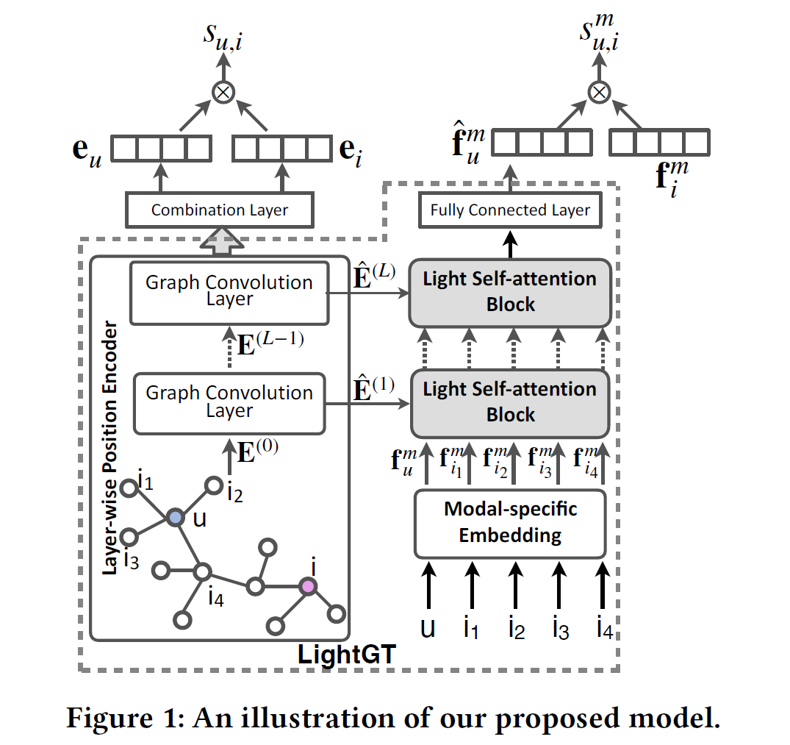
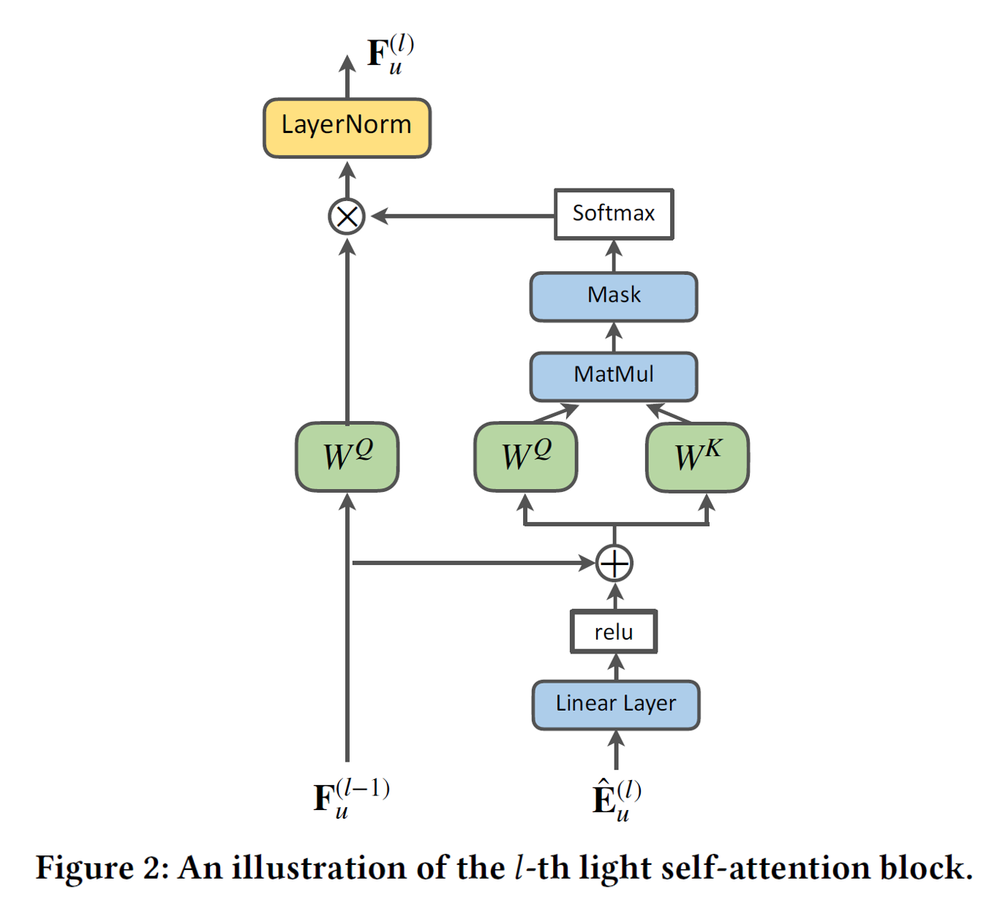

<div align="center">
<h2 align="center"> <b>LightGT: A Light Graph Transformer for Multimedia Recommendation</b>
</h2>
<div>
<a target="_blank" href="https://scholar.google.com/citations?user=im-bS2YAAAAJ">Yinwei&#160;Wei</a><sup>1</sup>,
<a target="_blank" href="https://github.com/Liuwq-bit">Wenqi&#160;Liu</a><sup>2</sup>,
<a target="_blank" href="https://scholar.google.com/citations?user=qjECBscAAAAJ">Fan&#160;Liu</a><sup>1</sup>,
<a target="_blank" href="https://scholar.google.com/citations?user=HdhaQB0AAAAJ">Xiang&#160;Wang</a><sup>3</sup>,
<a target="_blank" href="https://scholar.google.com/citations?user=yywVMhUAAAAJ">Liqiang&#160;Nie</a><sup>4</sup>,
<a target="_blank" href="https://scholar.google.com/citations?user=3kz6GDEAAAAJ">Tat-Seng&#160;Chua</a><sup>1</sup>
</div>
<sup>1</sup>National University of Singapore&#160;&#160;&#160;
<sup>2</sup>Shandong University&#160;&#160;&#160;
<br>
<sup>3</sup>University of Science and Technology of China&#160;&#160;&#160;
<sup>4</sup>Harbin Institute of Technology, Shenzhen&#160;&#160;&#160;
<br />
<div align="center">
    <a href="https://dl.acm.org/doi/10.1145/3539618.3591716" target="_blank">
    </a>
    <a href="https://github.com/iLearn-Lab/SIGIR23-LightGT" target="_blank">
    </a>
</div>
</div>

## Updates

- [04/2026] Formatted README.
- [07/2023] Paper accepted at ACM SIGIR 2023, Taipei.
- [07/2023] Code released.

---

## Introduction



This is the official PyTorch implementation of **LightGT**, a Light Graph Transformer for Multimedia Recommendation.

---

## Project Structure

```text
.
├── image/                 # Framework and model figures
│   ├── figure1.png
│   └── figure2.png
├── main.py                # Training and evaluation entry point
├── model.py               # LightGT model definition
├── transformer.py         # Transformer module
├── dataloader.py          # Data loading utilities
├── Parser.py              # Argument parser
├── sparsity_group_test.py # Sparsity group evaluation
└── README.md
```

---

## Installation

### 1. Clone the repository

```bash
git clone https://github.com/iLearn-Lab/SIGIR23-LightGT.git
cd SIGIR23-LightGT
```

### 2. Install dependencies

The code has been tested under Python 3.8.15. Required packages:

- PyTorch == 1.7.0
- NumPy == 1.23.4

---

## Dataset

You can find the full version of recommendation datasets via [Kwai](https://www.kuaishou.com/activity/uimc), [Tiktok](http://ai-lab-challenge.bytedance.com/tce/vc/), and [Movielens](https://grouplens.org/datasets/movielens/).
Due to copyright restrictions, we cannot release them directly.

||#Interactions|#Users|#Items|Visual|Acoustic|Textual|
|:-|:-|:-|:-|:-|:-|:-|
|Movielens|1,239,508|55,485|5,986|2,048|128|100|
|Tiktok|726,065|36,656|76,085|128|128|128|
|Kwai|1,664,305|22,611|329,510|2,048|-|100|

[MMGCN](https://github.com/weiyinwei/MMGCN) provides corresponding toy datasets that can be used for research.

Data format:
- `train.npy` — Train file. Each line is a user with positive interactions: (userID, itemID)
- `val.npy` — Validation file. Each line is a user with positive interactions: (userID, itemID)
- `test.npy` — Test file. Each line is a user with positive interactions: (userID, itemID)

---

## Usage

### Training & Evaluation

- Movielens dataset
  ```bash
  python main.py --l_r=1e-2 --weight_decay=1e-2 --src_len=50 --score_weight=0.05 --nhead=1 --transformer_layers=4 --batch_size=2048 --lightgcn_layers=4 --dataset=movielens
  ```

- Tiktok dataset
  ```bash
  python main.py --l_r=1e-2 --weight_decay=1e-2 --src_len=50 --score_weight=0.05 --nhead=1 --transformer_layers=4 --batch_size=2048 --lightgcn_layers=4 --dataset=tiktok
  ```

- Kwai dataset
  ```bash
  python main.py --l_r=1e-2 --weight_decay=1e-2 --src_len=50 --score_weight=0.05 --nhead=1 --transformer_layers=4 --batch_size=2048 --lightgcn_layers=4 --dataset=kwai
  ```

---

## Citation

If you find this work useful for your research, please kindly cite our paper:

```bibtex
@inproceedings{wei2023lightgt,
  title      = {Lightgt: A light graph transformer for multimedia recommendation},
  author     = {Wei, Yinwei and
                Liu, Wenqi and
                Liu, Fan and
                Wang, Xiang and
                Nie, Liqiang and
                Chua, Tat-Seng},
  booktitle  = {Proceedings of the 46th International ACM SIGIR Conference on Research and Development in Information Retrieval},
  pages      = {1508--1517},
  year       = {2023}
}
```

---

## Acknowledgement

<!-- - Thanks to [MMGCN](https://github.com/weiyinwei/MMGCN) for providing toy datasets. -->

This work is developed based on [MMGCN](https://github.com/weiyinwei/MMGCN) and [LightGCN](https://github.com/gusye1234/LightGCN-PyTorch). We thank the authors for their open-source contributions.
